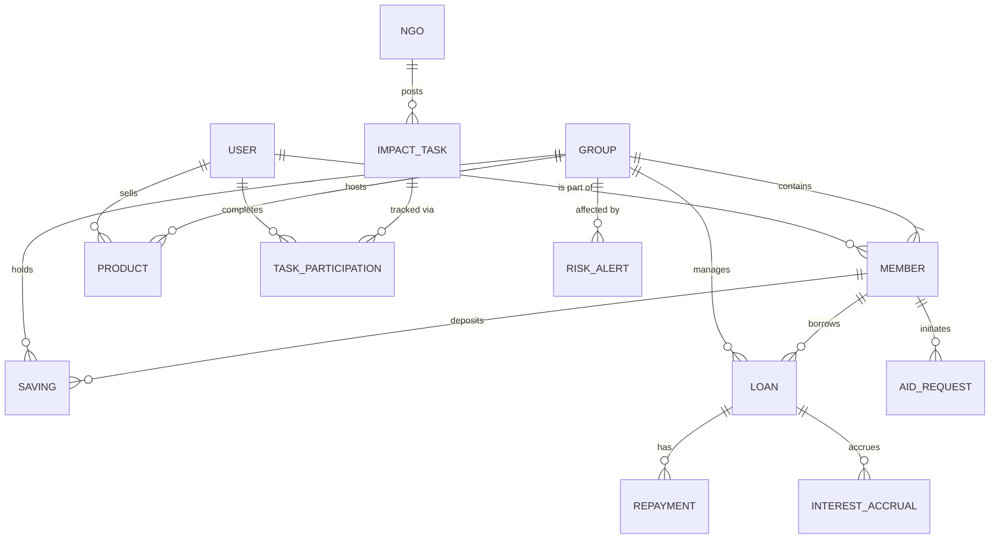

# AgriChama: System Architecture & Technical Documentation

AgriChama is a digital micro-economy engine designed to empower **Village Savings and Loan Associations (VSLAs)**, smallholder farmers, and communities in disaster-prone regions across Africa. It bridges the gap between traditional communal savings and modern financial inclusion.

---

## 1. Design Philosophy

### Aesthetic: "Modern Earthy Resilience"
The design language emphasizes stability, trust, and growth through a palette inspired by natural landscapes.
- **Typography:**
  - **Headings:** `Cormorant Garamond` (Serif) - Evokes heritage, elegance, and trustworthiness.
  - **Body:** `Inter` (Sans-serif) - Provides clarity and modern readability.
- **Color Palette:**
  - `Warm Background (#f5f5f0)`: Reduces eye strain and creates a welcoming atmosphere.
  - `Olive Primary (#5A5A40)`: Symbolizes growth, farming, and endurance.
  - `Sepia Accents (#fbf5e9)`: Connects to the history of ledger-based accounting.
- **Layout:** Bento-grid inspired dashboards for hierarchical information display, with rounded cards (24px) to soften the interface.

---

## 2. Role-Based Access Control (RBAC)

| Role | Description | Key Capabilities |
| :--- | :--- | :--- |
| **Leader** | VSLA Administrator | Group configuration, loan approval, member management, treasury oversight. |
| **Member** | Community User | Savings tracking, loan requests, marketplace selling, risk reporting. |
| **NGO** | Partner Organization | Impact task deployment, disaster relief funding, data-driven oversight. |
| **Buyer** | Marketplace Participant | Purchasing community produce, rating sellers, localized trade. |

---

## 3. Software Requirements Specification (SRS)

### Functional Requirements
1. **Financial Core:** Secure recording of member savings and automated interest accrual for loans.
2. **Lending Engine:** Workflow for loan application, risk assessment (TrustScore), approval, and scheduled repayment.
3. **Soko (Marketplace):** Peer-to-peer trade platform for agricultural produce with built-in rating systems.
4. **Relief & Tasks:** NGO-led "Impact Tasks" that reward members with internal currency for community service or data collection.
5. **Risk Intel:** Real-time crowdsourced reporting for pests, drought, or floods to activate community resilience protocols.

### Non-Functional Requirements
- **Security:** Firestore security rules enforcing strict data isolation between groups.
- **Offline Readiness:** (Targeted) Lean data fetching to accommodate low-bandwidth environments.
- **Responsiveness:** Fully mobile-first design ensuring accessibility on standard smartphones used in rural areas.

---

## 4. Sustainable Development Goals (SDGs)
AgriChama directly contributes to the following UN goals:
- **SDG 1: No Poverty** - Enabling micro-savings and accessible credit.
- **SDG 2: Zero Hunger** - Supporting smallholder farmers with market access and risk mitigation.
- **SDG 5: Gender Equality** - VSLAs are historically 80%+ women-led; digitizing them empowers women with documented financial history.
- **SDG 13: Climate Action** - Real-time disaster alerts and disaster relief funding modules.

---

## 5. Entity Relationship Diagram (ERD)

---

## 6. Firestore Schema (v1.0)

### Collections
- **`users`**: Central profile repository.
- **`groups`**: Metadata for VSLA clusters.
  - **`members`**: Sub-collection linking users and groups with balances.
  - **`savings`**: Immutable ledger of deposits.
  - **`loans`**: Credit records with state-machine statuses (`requested` → `active` → `repaid`).
    - **`repayments`**: History of payments towards specific loans.
  - **`products`**: Marketplace listings synced to a group's location.
  - **`notifcations`**: Actionable alerts (e.g., "Loan Repayment Due").
- **`risk_alerts`**: Global and localized disaster warnings.
- **`impact_tasks`**: NGO-provided opportunities for earning.

---

## 7. Component Architecture & Data Flow

### View Layer (React)
- **`App.tsx`**: Main router and auth-guard logic.
- **`DashboardView.tsx`**: The "Command Center" for members and leaders. Uses real-time listeners (`onSnapshot`) for liquidity tracking.
- **`SokoView.tsx`**: Handles marketplace logic, including the **Buy Now** state machine (Quantity selection -> Confirmation -> Transaction Ledger).
- **`ReliefView.tsx`**: NGO-facing dashboard for task deployment and risk oversight.

### State Management
- **Auth Context**: Persists user profile information and group-membership across sessions.
- **Real-time Synchronization**: Uses Firestore's `onSnapshot` for high-frequency updates on treasury balances, minimizing the need for manual refreshes.

## 8. Financial State Machine (Loans)

Loans follow a strict lifecycle to ensure group solvency:
1. **Requested**: Member submits a request (Amount, Duration, Purpose).
2. **Approved/Active**: Group Leader verifies group liquidity and authorizes the disbursement.
3. **Repayment Phase**: Member makes installments; interest is accrued based on group-defined rates.
4. **Repaid/Closed**: Loan is finalized and the member's credit visibility (TrustScore) improves.

---

## 9. Technical Stack
- **Frontend:** React 18 with Vite, Tailwind CSS (v4), Framer Motion.
- **State Management:** React Context API (Auth) + specialized hooks.
- **Backend:** Firebase (Authentication, Cloud Firestore).
- **Icons:** Lucide React.
- **Charts:** Recharts (for treasury and growth visualization).
